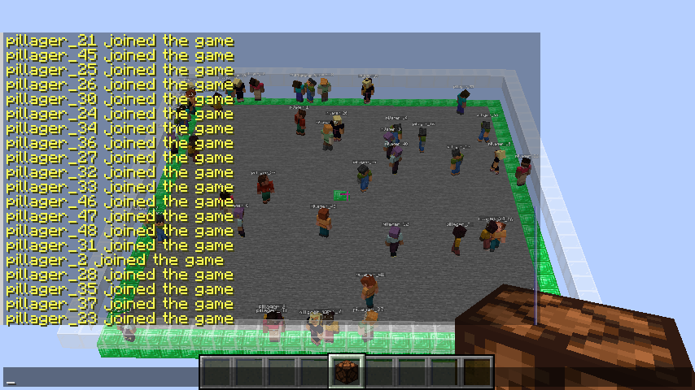

# Pillager
Load testing tool for Minecraft servers that spawns multiple 'pillagers' (headless clients) to raid the target server.

Developed to benchmark [mango](https://github.com/EDDxample/mango), it might be merged to its repo at some point.



## Usage
Check out the binaries in the [releases](https://github.com/EDDxample/pillager/releases) section, or build from source:
```
go build .
```
Parameters:
```
./pillager --help

Usage of pillager:
  -c int      Pillager Count (default 1)
  -h string   Server Hostname (default ":25565")
```
Examples:
```shell
./pillager -c 1 -h localhost
./pillager -c 1 -h localhost:25565
./pillager -c 1 -h :25565
```

## TODO
- [x] Connect to offline, uncompressed servers (online-mode=false & network-compression-threshold=-1).
- [x] Spawn multiple clients.
- [x] Client move, rotate, and move-and-rotate packets.
- [x] KeepAlive support.
- [ ] Compressed server support.
- [ ] Other client packets (jump, clicks, etc).
